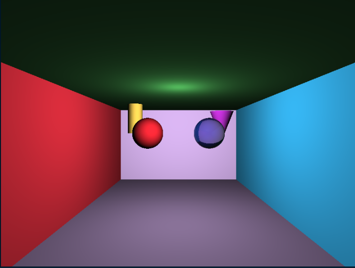

# Raytracer

- Ray tracing is a technique used to generate realistic digital images by simulating the inverse path of light. Your goal is to create a program able to generate an image from a file describing the scene.

## Prerequisites

You need to install :

- [CMAKE](https://cmake.org/cmake/help/latest/command/install.html) to compile project
## Installation

Clone the project

```bash
    git clone git@github.com:EpitechPromo2028/B-OOP-400-LIL-4-1-raytracer-mathis.bukowski.git raytracer
    cd raytracer
```

Init and create the project

```bash
    mkdir -p build && cd build
    cmake .. -G "Unix Makefiles" -DCMAKE_BUILD_TYPE=Release
    cmake --build .
    cd ..
```

Run the project!

```bash
    ./raytracer [scene_file]
```

## Documentation

On the directory, you will be able to find the technical documentation to build with:
```bash
    doxide build
    mkdocs build
    mkdocs serve
```

You will also find a guide (below) for creating a scene.

## Guide

### How to create a scene for RayTracer Project ? Let's dive in !
#### Here you will find all tools to build your own scene.

- File :
```cfg
# Setting up the camera
camera = {
     resolution = { width = 800; height = 600; }; # resolution of the image
     position = { x = 0.0; y = 1.0; z = 10.0; }; # position of the camera
     rotation = { x = 0.0; y = 0.0; z = 0.0; }; # rotation of the camera
     fov = 60.0; # field of view
};

# Setting up the lights
lights = (
         {
                  type = "point"; # type of the light point light
                  position = { x = 0.0; y = 5.0; z = 5.0; }; # position of the light
                  intensity = 0.6; # intensity of the light
                  color = { r = 1.0; g = 1.0; b = 1.0; }; # color of the light
         },
         {
                  type = "point"; # type of the light point light
                  position = { x = 0.5; y = 2.0; z = 1.0; }; # position of the light
                  intensity = 0.6; # intensity of the light
                  color = { r = 0.8; g = 0.5; b = 1.0; }; # color of the light
         }
);

# Setting up the primitives 
primitives = {
        # Setting up the spheres
         spheres = (
                  {
                           center = { x = -2.0; y = 1.0; z = -5.0; }; # center position of the sphere
                           radius = 1.0; # radius of the sphere
                           material = {
                                    type = "flat"; # type of the material
                                    color = { r = 0.2; g = 1.0; b = 0.2; }; # color of the sphere
                           };
                  },
                  {
                        center = { x = 2.0; y = 1.0; z = -5.0; }; # center position of the sphere
                        radius = 1.0; # radius of the sphere
                        material = {
                                type = "transparent"; # type of the material
                                color = { r = 0.2; g = 0.2; b = 1.0; };  # color of the sphere
                                transparency = 0.7; # transparency of the sphere
                        };
                }
         );
         
        # Setting up the planes
         planes = (
                  {
                           normal = { x = 0.0; y = 1.0; z = 0.0; }; # normal vector of the plane
                           point = { x = 0.0; y = -1.0; z = 0.0; }; # point on the plane
                           material = {
                                    type = "flat"; # type of the material
                                    color = { r = 0.3; g = 0.8; b = 0.3; }; # color of the plane
                           };
                  },
                  {
                           normal = { x = 0.0; y = 0.0; z = 1.0; };
                           point = { x = 0.0; y = 0.0; z = -10.0; };
                           material = {
                                    type = "flat";
                                    color = { r = 0.8; g = 0.8; b = 0.8; }; # back wall grey
                           };
                  },
                  {
                           normal = { x = 1.0; y = 0.0; z = 0.0; };
                           point = { x = -5.0; y = 0.0; z = 0.0; };
                           material = {
                                    type = "flat";
                                    color = { r = 0.8; g = 0.2; b = 0.2; }; # left wall red
                           };
                  },
                  {
                           normal = { x = -1.0; y = 0.0; z = 0.0; };
                           point = { x = 5.0; y = 0.0; z = 0.0; };
                           material = {
                                    type = "flat";
                                    color = { r = 0.2; g = 0.8; b = 0.8; }; # right wall cyan
                           };
                  },
                  {
                           normal = { x = 0.0; y = -1.0; z = 0.0; };
                           point = { x = 0.0; y = 5.0; z = 0.0; };
                           material = {
                                    type = "flat";
                                    color = { r = 0.5; g = 0.5; b = 0.5; }; # floor grey
                           };
                  }
         );
         
        # Setting up the cylinders
         cylinders = (
                  {
                           base = { x = -3.0; y = -1.0; z = -6.0; }; # base position of the cylinder
                           axis = { x = 0.0; y = 1.0; z = 0.0; }; # axis of the cylinder
                           radius = 0.5; # radius of the cylinder
                           height = 2.0; # height of the cylinder
                           color = { r = 1; g = 1; b = 0; }; # color of the cylinder
                           material = {
                                    type = "flat"; # type of the material
                                    color = { r = 1.0; g = 1.0; b = 0.3; }; # yellow
                           };
                  }
         );
         
        # Setting up the cones
         cones = (
                  {
                           apex = { x = 3.0; y = 1.5; z = -6.0; }; # apex position of the cone
                           axis = { x = 0.0; y = -1.0; z = 0.0; }; # axis of the cone 
                           baseRadius = 0.8; # base radius of the cone
                           height = 2.0; # height of the cone
                           color = { r = 1; g = 0; b = 1; }; # color of the cone
                           material = {
                                    type = "flat"; # type of the material
                                    color = { r = 1.0; g = 0.3; b = 1.0; }; # purple
                           };
                  }
         );
};
```

#### You can add as many lights, spheres, planes, cylinders and cones as you want.

Here is the result of the scene above:



## Authors

- Mathis Bukowski - Developer, Mail: mathis.bukowski@epitech.eu
- Rafael Drouart - Developer. Mail: rafael.drouart@epitech.eu
- Valentin Frappart - Developer. Mail: valentin.frappart@epitech.eu


